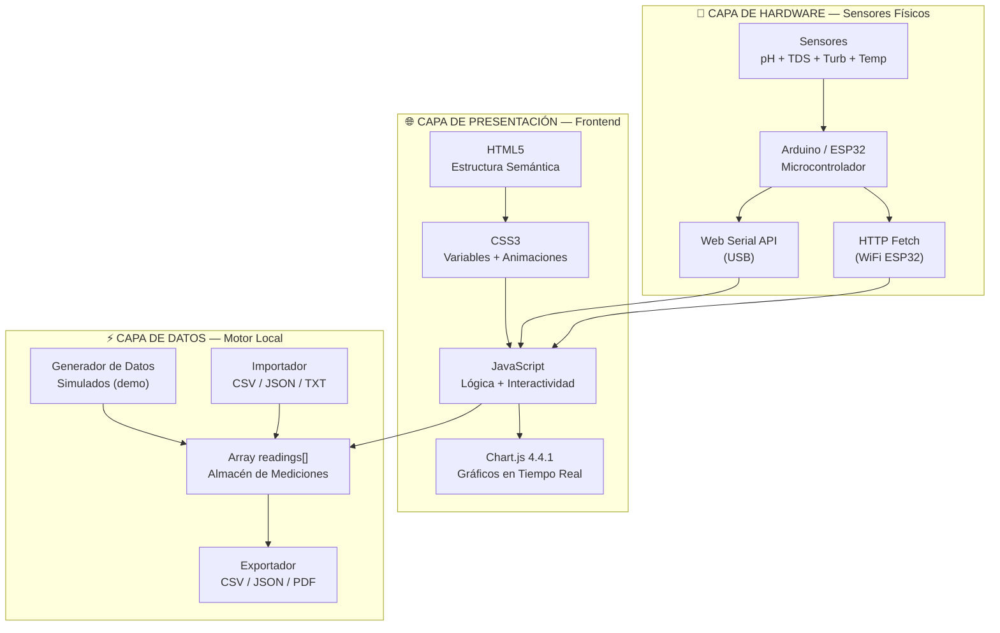
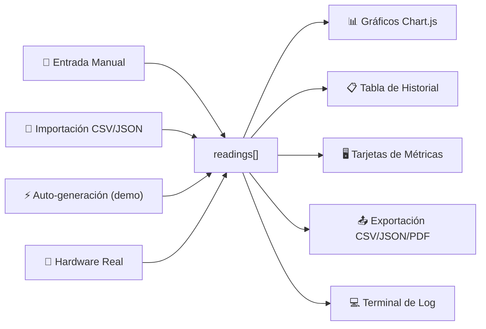
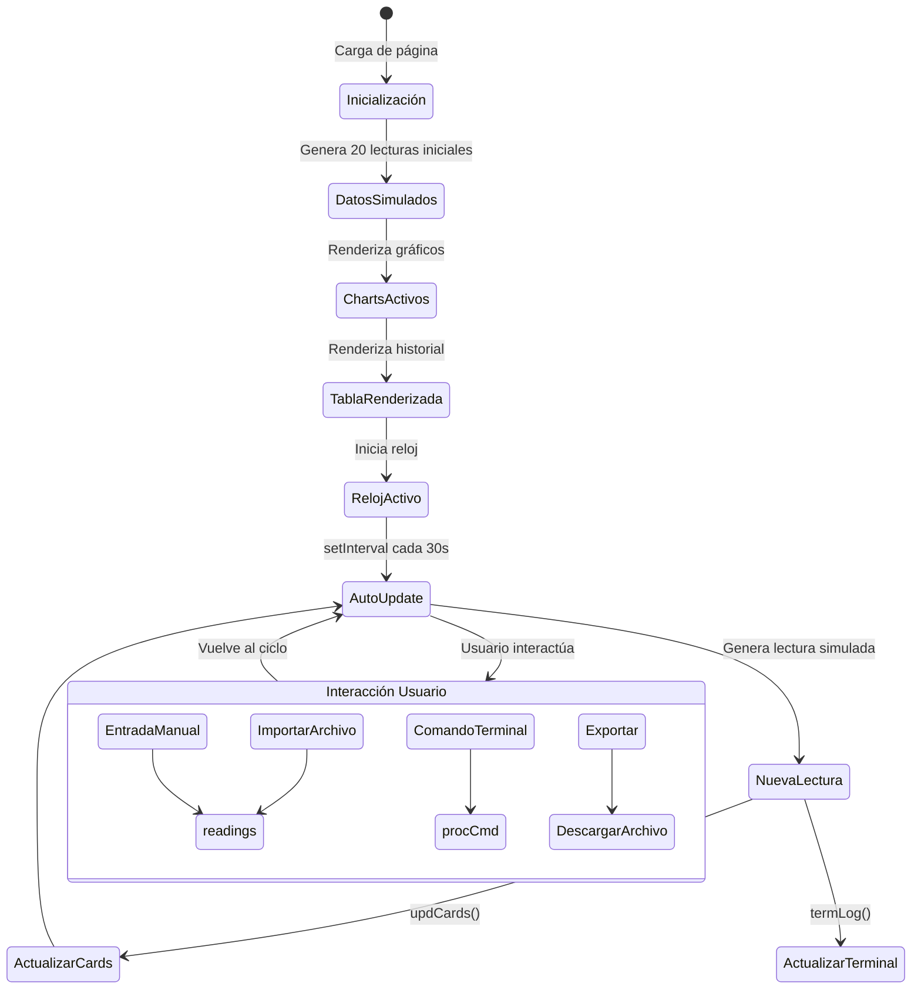

# 🏗️ AQUANUBE — Arquitectura y Estructura Técnica

## Documentación completa de la estructura, arquitectura y funcionamiento del sistema

> [!NOTE]
> Este documento describe en detalle cómo está construido el dashboard web de AQUANUBE, su organización interna, los patrones de diseño utilizados y el flujo de datos completo del sistema.

---

## 📐 Visión General de la Arquitectura



---

## 📁 Estructura del Proyecto

El dashboard está organizado en **archivos separados por responsabilidad**: `index.html`
para la estructura, un único `styles.css` para el diseño y varios módulos JavaScript que
se cargan en orden de dependencia. Funciona tanto abriendo `index.html` directamente como
servido por nginx (Docker).

```
index.html ......................... Estructura HTML (head + secciones + modales)
│   ├── <head>: fuentes, Font Awesome, Chart.js, html2pdf, styles.css
│   └── <body>: notificación, nav, HERO, EXPLICACIÓN, DASHBOARD,
│              DATOS, SISTEMA, MATERIALES, IMPACTO, MISIÓN, FOOTER, modales
│
assets/css/styles.css .............. Todo el diseño (tema espacial)
│   ├── Variables (:root), reset y base
│   ├── Nav, hero, secciones, tarjetas, gráficos, tablas, formularios
│   ├── Terminal, diagrama de flujo, modales, footer
│   ├── Animaciones y media queries (@960px, @580px)
│   └── Refinamiento 2026: barra de modo, badge de estado,
│       flujo "en vivo", micro-interacciones, prefers-reduced-motion
│
assets/js/ (módulos en orden de carga)
│   ├── state.js ........ readings[], localStorage, etapaMap, computeStatus()
│   ├── charts.js ....... 5 gráficos Chart.js + updateChartsWithNewData()
│   ├── hardware.js ..... Web Serial (Arduino) + fetch al ESP32/NodeMCU
│   ├── simulation.js ... Modo Demostración: genReading(), demoTick(),
│   │                     start/stop/toggleDemo(), setMode()
│   ├── ui.js ........... tabla, modales, formulario, pestañas,
│   │                     importar/exportar (CSV/JSON/PDF), terminal, notif
│   └── main.js ......... arranque: render inicial, reloj, scroll-spy, reveals
│
assets/img/ ........................ logo_stem.png, equipo.png
```

### Modo Demostración (simulación)

`simulation.js` permite exponer el dashboard "en vivo" sin hardware conectado. Al activarlo,
genera una lectura nueva cada pocos segundos (intervalo configurable con el control deslizante)
mediante un *random walk* de valores creíbles (pH ~7.1, TDS ~134 ppm, turbidez ~0.4 NTU,
temperatura 22–26 °C). Cada lectura entra al **mismo flujo que los datos reales**
(`updCards → renderTable → updateChartsWithNewData → checkAlerts`), por lo que tarjetas,
gráficos, tabla y diagrama de filtración reaccionan igual que con un sensor físico.
La demo y el hardware son **mutuamente excluyentes**: conectar un Arduino detiene la simulación.

---

## 🎨 Sistema de Diseño (Design System)

### Paleta de Colores

| Variable | Valor | Uso |
|---|---|---|
| `--nasa-blue` | `#0B3D91` | Acento institucional, elementos NASA |
| `--nasa-red` | `#FC3D21` | Temperatura, alertas |
| `--space-dark` | `#060B17` | Fondo principal |
| `--space-card` | `#111D2E` | Fondo de tarjetas |
| `--space-border` | `#1A2F4A` | Bordes de elementos |
| `--aqua` | `#00D4FF` | Color primario, TDS, enlaces activos |
| `--green-pure` | `#00FF88` | pH, estados óptimos, éxito |
| `--amber` | `#FFB800` | Turbidez, advertencias |
| `--purple` | `#B57BFF` | Impacto social, badges |
| `--text-primary` | `#E8F4FF` | Texto principal |
| `--text-secondary` | `#8BACC8` | Texto secundario |
| `--text-muted` | `#4A6A8A` | Texto atenuado, etiquetas |

### Tipografías

| Font | Variable | Uso |
|---|---|---|
| **Orbitron** | `--font-display` | Títulos, valores numéricos, branding |
| **Space Grotesk** | `--font-body` | Texto de cuerpo, descripciones |
| **JetBrains Mono** | `--font-mono` | Terminal, etiquetas, datos técnicos |

### Componentes Visuales

| Componente | Clase CSS | Descripción |
|---|---|---|
| Tarjeta base | `.card` | Fondo oscuro con borde sutil, hover interactivo |
| Métrica | `.mc` | Tarjeta con barra de color superior, icono, valor grande |
| Badge | `.badge` | Etiqueta redondeada con variantes `.blue`, `.green`, `.purple` |
| Botón primario | `.btn-p` | Fondo aqua, texto oscuro |
| Botón secundario | `.btn-s` | Transparente con borde |
| Pill de estado | `.pill` | Variantes `.ok`, `.warn`, `.bad` |
| Terminal | `.term-wrap` | Emulador visual con barra de dots macOS |
| Nodo de flujo | `.fnode` | Variantes `.src`, `.act`, `.out` |

---

## ⚙️ Arquitectura JavaScript

### Modelo de Datos

```javascript
// Estructura de una lectura/medición
{
  ts: "2026-05-18T19:00:00.000Z",  // ISO timestamp
  ph: 7.1,                          // pH (0-14)
  temp: 24.2,                       // Temperatura °C
  tds: 134,                         // Sólidos disueltos (ppm)
  turb: 0.4,                        // Turbidez (NTU)
  vol: 420,                         // Volumen recolectado (mL)
  stage: "carbon",                   // Etapa: sin_filtro|lienzo|carbon|arena|hervida
  claridad: "cristalina",           // Evaluación visual
  olor: "ninguno",                   // Evaluación olfativa
  sensor: "arduino",                 // Fuente: arduino|manual|laboratorio
  status: "optimal",                 // Estado: optimal|warn|alert
  obs: "Observaciones opcionales"    // Notas del operador
}
```

### Flujo de Datos



### Módulos Funcionales

| Módulo | Funciones | Líneas | Responsabilidad |
|---|---|---|---|
| **Data** | `gen()` | 826-837 | Generador de datos simulados |
| **Charts** | — (inicialización) | 839-876 | 5 gráficos Chart.js (pH/TDS, Vol, Turb, Mejora, Temp) |
| **Table** | `statusPill()`, `renderTable()` | 878-896 | Renderizado del historial con pills de estado |
| **Form** | `submitManual()`, `updCards()` | 898-934 | Captura y validación de formulario manual |
| **Tabs** | `switchTab()` | 936-942 | Navegación entre pestañas |
| **File** | `dragOver()`, `dropFile()`, `handleFile()`, `procFile()`, `importData()` | 944-950 | Drag & drop y procesamiento de archivos |
| **Export** | `exportCSV()`, `exportJSON()`, `dl()` | 952-955 | Generación y descarga de archivos |
| **Terminal** | `termLog()`, `termKey()`, `cmd()`, `procCmd()`, `updInterval()` | 957-979 | Emulador de comandos del sistema |
| **Notif** | `notif()` | 981-988 | Notificaciones flotantes tipo toast |
| **Clock** | `setInterval()` | 990-991 | Reloj del sistema en la barra nav |
| **Auto-Update** | `setInterval()` | 993-998 | Lectura automática cada 30 segundos |
| **Scroll** | `IntersectionObserver` | 1003-1005 | Animaciones fade-in al scroll |
| **Nav** | `scroll` event | 1007-1012 | Highlight del enlace activo en nav |

### Comandos de Terminal Disponibles

| Comando | Acción |
|---|---|
| `READ` / `READ ALL` | Muestra la última lectura de sensores |
| `STATUS` | Estado general del sistema y filtros |
| `FILTRO ON` | Activa la filtración |
| `FILTRO OFF` | Detiene la filtración |
| `RESET` | Reinicia el sistema |
| `HELP` | Lista comandos disponibles |

---

## 📊 Gráficos del Dashboard

| Gráfico | Tipo | Canvas ID | Datos | Colores |
|---|---|---|---|---|
| pH y TDS 24h | Line | `cMain` | 24 puntos horarios | Verde (#00FF88), Aqua (#00D4FF) |
| Volumen Diario | Bar | `cVol` | 7 días de la semana | Amber (#FFB800) |
| Turbidez | Line | `cTurb` | 24 puntos horarios | Amber (#FFB800) |
| Mejora por Etapa | Bar | `cMejora` | 4 etapas del filtro | Aqua → Verde gradiente |
| Temperatura | Line | `cTemp` | 24 puntos horarios | Rojo (#FC3D21) |

---

## 📱 Diseño Responsive

### Breakpoints

| Breakpoint | Cambios |
|---|---|
| `≤ 960px` | Métricas a 1 columna, gráficos apilados, nav links ocultos, misión 1 col |
| `≤ 580px` | Métricas a 2 columnas, formulario a 1 col, materiales a 2 col |

### Grid Systems Utilizados

| Sección | Desktop | Tablet | Mobile |
|---|---|---|---|
| Hero Metrics | 4 columnas | 2 columnas | 2 columnas |
| Metric Cards | 4 columnas | 1 columna | 1 columna |
| Charts Principal | 2fr 1fr | 1 columna | 1 columna |
| Charts Secundarios | 1fr 1fr 1fr | 1 columna | 1 columna |
| Formulario | 3 columnas | 2 columnas | 1 columna |
| Impacto | 3 columnas | 1 columna | 1 columna |
| Materiales | 4 columnas | 2 columnas | 2 columnas |
| Misión | 1.4fr 1fr | 1 columna | 1 columna |
| Exportar | 3 columnas | 1 columna | 1 columna |

---

## 🔄 Ciclo de Vida del Sistema



---

## 🔒 Consideraciones Técnicas

### Sin Backend
El sistema opera **100% client-side**. No hay servidor ni base de datos. Los datos se mantienen en memoria durante la sesión y se pierden al cerrar la página (a menos que se exporten).

### CDN Dependencies
| Dependencia | CDN | Versión |
|---|---|---|
| Chart.js | cdnjs.cloudflare.com | 4.4.1 |
| Font Awesome | cdnjs.cloudflare.com | 6.5.0 |
| Google Fonts | fonts.googleapis.com | Orbitron, Space Grotesk, JetBrains Mono |

### Compatibilidad de Navegador
| Feature | Chrome | Firefox | Safari | Edge |
|---|---|---|---|---|
| Dashboard web | ✅ | ✅ | ✅ | ✅ |
| Web Serial API (Arduino) | ✅ | ❌ | ❌ | ✅ |
| Fetch HTTP (ESP32) | ✅ | ✅ | ✅ | ✅ |
| Drag & Drop archivos | ✅ | ✅ | ✅ | ✅ |
| IntersectionObserver | ✅ | ✅ | ✅ | ✅ |

### Rendimiento
- Archivo HTML único de ~59 KB
- Sin framework pesado — vanilla JS
- Animaciones CSS hardware-accelerated (`transform`, `opacity`)
- Datos limitados a 100 lecturas en memoria (buffer circular)

---

## 🚀 Roadmap de Evolución

| Fase | Estado | Descripción |
|---|---|---|
| **v1.0** Dashboard web con datos simulados | ✅ Completado | Dashboard funcional con gráficos, formularios, terminal |
| **v1.1** Integración hardware Arduino/ESP32 | 🔄 En desarrollo | Sensores reales conectados al dashboard |
| **v2.0** Persistencia de datos | 📋 Planificado | LocalStorage o IndexedDB para guardar datos entre sesiones |
| **v2.1** Backend con API | 📋 Planificado | Servidor Node.js/Python para almacenamiento permanente |
| **v3.0** IoT cloud + alertas | 📋 Futuro | Firebase/AWS IoT con notificaciones push |
