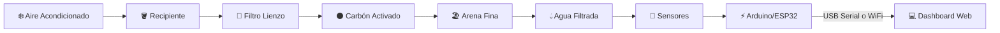
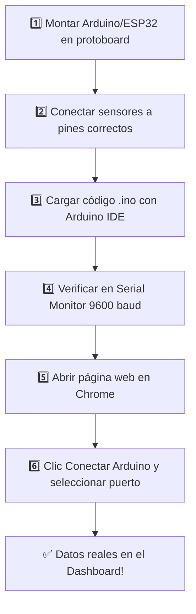

# 🔌 AQUANUBE — Integración de Hardware

## Guía Completa de Componentes, Conexiones y Código para el Sistema Físico

> [!IMPORTANT]
> Este documento detalla **todo lo necesario** para que el dashboard web de AQUANUBE reciba datos reales desde sensores físicos conectados a un Arduino/ESP32.

---

## 📐 Arquitectura del Sistema Completo



---

## 🛒 Lista de Componentes (BOM)

### Microcontrolador — Elegir UNO

| Componente | Descripción | Precio Est. (USD) | Notas |
|---|---|---|---|
| **Arduino UNO R3** | Conexión USB Serial a la PC | $8–15 | Opción simple, requiere PC conectada |
| **ESP32 DevKit** ⭐ | WiFi integrado, envía datos sin cable | $5–10 | **Recomendado** — conexión inalámbrica |

### Sensores

| Sensor | Modelo | Qué mide | Precio Est. |
|---|---|---|---|
| **Sensor pH** | PH-4502C + sonda E-201-C | pH del agua (0–14) | $8–12 |
| **Sensor TDS** | TDS Meter V1.0 (DFRobot) | Sólidos disueltos (ppm) | $4–7 |
| **Sensor Turbidez** | SKU SEN0189 (DFRobot) | Turbidez del agua (NTU) | $8–12 |
| **Sensor Temperatura** | DS18B20 (sumergible) | Temperatura °C | $2–4 |

### Materiales de Apoyo

| Material | Cantidad | Uso |
|---|---|---|
| Protoboard (breadboard) | 1 | Conexiones sin soldar |
| Cables Dupont M-M / M-F | 20+ | Conexión sensores → Arduino |
| Resistencia 4.7kΩ | 1 | Pull-up para DS18B20 |
| Cable USB tipo B (o USB-C si ESP32) | 1 | Comunicación con la PC |
| Fuente 5V / Power Bank (opcional) | 1 | Alimentación autónoma |

> [!TIP]
> **Costo total estimado: $35–60 USD** con todos los sensores. Si ya tienen Arduino, solo necesitan los sensores (~$22–35).

---

## 🔌 Diagrama de Conexiones

### Opción A: Arduino UNO

```
Arduino UNO R3
┌──────────────────────┐
│                      │
│  A0 ◄──── pH Sensor (señal analógica)
│  A1 ◄──── TDS Sensor (señal analógica)
│  A2 ◄──── Turbidez Sensor (señal analógica)
│  D2 ◄──── DS18B20 Temperatura (digital, con R 4.7kΩ a 5V)
│                      │
│  5V ────► Alimentación sensores (VCC)
│  GND ───► GND común todos los sensores
│                      │
│  USB ────► PC (Serial 9600 baud)
└──────────────────────┘
```

### Opción B: ESP32 (WiFi) ⭐

```
ESP32 DevKit V1
┌──────────────────────┐
│                      │
│  GPIO 34 ◄── pH Sensor (ADC1)
│  GPIO 35 ◄── TDS Sensor (ADC1)
│  GPIO 32 ◄── Turbidez Sensor (ADC1)
│  GPIO 4  ◄── DS18B20 (con R 4.7kΩ a 3.3V)
│                      │
│  3.3V ──► Alimentación sensores
│  GND ───► GND común
│                      │
│  WiFi ──► Envía JSON a la web
└──────────────────────┘
```

> [!WARNING]
> El ESP32 usa **3.3V** en sus pines ADC. Algunos sensores de pH necesitan un divisor de voltaje si la salida supera 3.3V. Verificar la hoja de datos del sensor.

---

## 💻 Código Arduino (Opción A — USB Serial)

```cpp
// AQUANUBE — Sistema de Monitoreo de Agua
// Guardianes de la Ciencia · STEM Bolivia 2026

#include <OneWire.h>
#include <DallasTemperature.h>

#define PH_PIN      A0
#define TDS_PIN     A1
#define TURB_PIN    A2
#define TEMP_PIN    2
#define INTERVALO_MS 30000
#define BAUD_RATE    9600

OneWire oneWire(TEMP_PIN);
DallasTemperature tempSensor(&oneWire);

float PH_OFFSET  = 0.0;
float TDS_FACTOR  = 0.5;
float TURB_FACTOR = 1.0;

void setup() {
  Serial.begin(BAUD_RATE);
  tempSensor.begin();
  Serial.println("{\"event\":\"init\",\"system\":\"AQUANUBE v1.0\"}");
  Serial.println("{\"event\":\"status\",\"msg\":\"Sensores calibrados OK\"}");
}

void loop() {
  float ph   = leerPH();
  float tds  = leerTDS();
  float turb = leerTurbidez();
  float temp = leerTemperatura();

  Serial.print("{\"ph\":");      Serial.print(ph, 2);
  Serial.print(",\"tds\":");     Serial.print(tds, 0);
  Serial.print(",\"turb\":");    Serial.print(turb, 2);
  Serial.print(",\"temp\":");    Serial.print(temp, 1);
  Serial.print(",\"ts\":\"");    Serial.print(millis());
  Serial.println("\"}");
  delay(INTERVALO_MS);
}

float leerPH() {
  int raw = analogRead(PH_PIN);
  float voltage = raw * (5.0 / 1024.0);
  float ph = 3.5 * voltage + PH_OFFSET;
  return constrain(ph, 0.0, 14.0);
}

float leerTDS() {
  int raw = analogRead(TDS_PIN);
  float voltage = raw * (5.0 / 1024.0);
  return max(voltage * TDS_FACTOR * 1000, 0.0);
}

float leerTurbidez() {
  int raw = analogRead(TURB_PIN);
  float voltage = raw * (5.0 / 1024.0);
  return max((4.5 - voltage) * TURB_FACTOR, 0.0);
}

float leerTemperatura() {
  tempSensor.requestTemperatures();
  return tempSensor.getTempCByIndex(0);
}
```

**Librerías necesarias** (instalar desde Arduino IDE → Gestor de Librerías):
- **OneWire** — por Jim Studt
- **DallasTemperature** — por Miles Burton

---

## 🌐 Código ESP32 (Opción B — WiFi + Web Server)

```cpp
// AQUANUBE — ESP32 WiFi Web Server
#include <WiFi.h>
#include <WebServer.h>
#include <OneWire.h>
#include <DallasTemperature.h>

const char* SSID     = "NombreDeRedWiFi";
const char* PASSWORD = "ContraseñaWiFi";

#define PH_PIN   34
#define TDS_PIN  35
#define TURB_PIN 32
#define TEMP_PIN 4

OneWire oneWire(TEMP_PIN);
DallasTemperature tempSensor(&oneWire);
WebServer server(80);
float lastPH, lastTDS, lastTurb, lastTemp;

void setup() {
  Serial.begin(115200);
  tempSensor.begin();
  WiFi.begin(SSID, PASSWORD);
  while (WiFi.status() != WL_CONNECTED) { delay(500); Serial.print("."); }
  Serial.println("\nConectado! IP: " + WiFi.localIP().toString());

  server.on("/api/data", HTTP_GET, []() {
    server.sendHeader("Access-Control-Allow-Origin", "*");
    String json = "{";
    json += "\"ph\":" + String(lastPH, 2) + ",";
    json += "\"tds\":" + String(lastTDS, 0) + ",";
    json += "\"turb\":" + String(lastTurb, 2) + ",";
    json += "\"temp\":" + String(lastTemp, 1) + ",";
    json += "\"ts\":\"" + String(millis()) + "\"";
    json += "}";
    server.send(200, "application/json", json);
  });
  server.begin();
}

void loop() {
  server.handleClient();
  static unsigned long lastRead = 0;
  if (millis() - lastRead > 30000) {
    lastRead = millis();
    lastPH   = leerPH();
    lastTDS  = leerTDS();
    lastTurb = leerTurbidez();
    lastTemp = leerTemperatura();
  }
}

float leerPH() {
  int raw = analogRead(PH_PIN);
  float voltage = raw * (3.3 / 4095.0);
  return constrain(3.5 * voltage, 0.0, 14.0);
}
float leerTDS() {
  int raw = analogRead(TDS_PIN);
  float voltage = raw * (3.3 / 4095.0);
  return max(voltage * 500.0, 0.0);
}
float leerTurbidez() {
  int raw = analogRead(TURB_PIN);
  float voltage = raw * (3.3 / 4095.0);
  return max((3.3 - voltage) * 1.0, 0.0);
}
float leerTemperatura() {
  tempSensor.requestTemperatures();
  return tempSensor.getTempCByIndex(0);
}
```

---

## 🔗 Integración con la Página Web

### Método 1: Web Serial API (Arduino USB) — Chrome/Edge

```javascript
// WEB SERIAL — CONEXIÓN DIRECTA CON ARDUINO
let serialPort = null;
let serialReader = null;

async function conectarArduino() {
  try {
    serialPort = await navigator.serial.requestPort();
    await serialPort.open({ baudRate: 9600 });
    const decoder = new TextDecoderStream();
    serialPort.readable.pipeTo(decoder.writable);
    serialReader = decoder.readable.getReader();
    termLog('Arduino conectado por USB Serial', 'ok');
    notif('Arduino conectado', 'Leyendo datos en tiempo real');

    let buffer = '';
    while (true) {
      const { value, done } = await serialReader.read();
      if (done) break;
      buffer += value;
      const lines = buffer.split('\n');
      buffer = lines.pop();
      for (const line of lines) {
        try {
          const data = JSON.parse(line.trim());
          if (data.ph !== undefined) procesarLectura(data);
        } catch (e) {}
      }
    }
  } catch (err) {
    termLog('Error de conexión: ' + err.message, 'er');
  }
}

function procesarLectura(data) {
  const r = {
    ts: new Date().toISOString(),
    ph: data.ph, temp: data.temp, tds: data.tds, turb: data.turb,
    vol: 0, stage: 'carbon',
    claridad: data.turb < 1 ? 'cristalina' : 'turbia',
    olor: 'ninguno', sensor: 'arduino',
    status: data.ph >= 6.5 && data.ph <= 8.5 && data.tds < 300 && data.turb < 1
            ? 'optimal' : 'warn',
    obs: 'Lectura automática Arduino'
  };
  readings.push(r);
  updCards(r.ph, r.temp, r.tds, r.turb, r.vol);
  renderTable();
  termLog(`pH ${r.ph} | TDS ${r.tds}ppm | Turb ${r.turb}NTU | Temp ${r.temp}°C`, 'vl');
}

async function desconectarArduino() {
  if (serialReader) { serialReader.cancel(); serialReader = null; }
  if (serialPort)   { await serialPort.close(); serialPort = null; }
  termLog('Arduino desconectado', 'er');
}
```

### Método 2: Fetch HTTP (ESP32 WiFi) — Cualquier navegador

```javascript
let esp32IP = '192.168.1.100';
let fetchInterval = null;

function conectarESP32(ip) {
  esp32IP = ip || esp32IP;
  fetchInterval = setInterval(async () => {
    try {
      const res = await fetch(`http://${esp32IP}/api/data`);
      const data = await res.json();
      procesarLectura(data);
    } catch (err) {
      termLog('Sin conexión con ESP32: ' + err.message, 'er');
    }
  }, 30000);
  termLog(`Conectado a ESP32 en ${esp32IP}`, 'ok');
  notif('ESP32 conectado', `IP: ${esp32IP}`);
}

function desconectarESP32() {
  clearInterval(fetchInterval);
  termLog('ESP32 desconectado', 'er');
}
```

---

## 📋 Cambios Necesarios en la Página Web

1. **Botón de conexión** en la sección "Sistema" para conectar/desconectar Arduino o ESP32
2. **Indicador de conexión** — cambiar "SISTEMA EN LÍNEA" para reflejar si hay hardware real o datos simulados
3. **Desactivar auto-generación** de datos cuando haya hardware conectado
4. **Agregar código JavaScript** — integrar las funciones mostradas arriba en el bloque `<script>`

---

## 🔧 Pasos de Montaje Físico



---

## ⚠️ Calibración de Sensores

| Sensor | Cómo calibrar | Soluciones necesarias |
|---|---|---|
| **pH** | Sumergir en buffer pH 4.0 y pH 7.0, ajustar potenciómetro | Buffer pH 4.0 y pH 7.0 ($3–5) |
| **TDS** | Comparar con medidor TDS comercial o solución 342 ppm NaCl | Medidor TDS de referencia ($5) |
| **Turbidez** | Agua destilada = 0 NTU, ajustar offset en código | Agua destilada ($1) |
| **Temperatura** | Comparar con termómetro en agua helada y tibia | Termómetro de referencia |

---

## 📊 Comparativa Arduino vs ESP32

| Característica | Arduino UNO (USB) | ESP32 (WiFi) |
|---|---|---|
| Conexión | Cable USB a la PC | WiFi inalámbrico |
| Navegador | Chrome/Edge (Web Serial API) | Cualquiera (HTTP) |
| Requiere PC conectada | ✅ Sí | ❌ No, autónomo |
| Dificultad | ⭐ Fácil | ⭐⭐ Media |
| Costo extra | Ninguno | Ninguno |
| Mejor para | Demostración en mesa | Instalación permanente |

> [!TIP]
> **Recomendación para las Olimpiadas STEM:** Usar **Arduino UNO** para la demostración en vivo (más simple), y tener el **ESP32** como versión avanzada para mostrar escalabilidad.

---

## 🛡️ Solución de Problemas

| Problema | Causa probable | Solución |
|---|---|---|
| No aparecen datos en Serial Monitor | Baud rate incorrecto | Verificar 9600 baud |
| pH siempre muestra 0 o 14 | Sensor desconectado | Verificar conexión A0 y VCC |
| Temperatura muestra -127°C | DS18B20 no detectado | Verificar resistencia pull-up 4.7kΩ |
| ESP32 no conecta al WiFi | Credenciales incorrectas | Verificar SSID y contraseña |
| Web Serial no aparece | Navegador no compatible | Usar Chrome 89+ o Edge 89+ |

---

## 🎯 Resumen Ejecutivo

| Ítem | Detalle |
|---|---|
| **Componentes mínimos** | Arduino + sensor pH + sensor TDS + sensor temp + cables |
| **Costo mínimo** | ~$20–30 USD |
| **Costo completo (4 sensores)** | ~$35–60 USD |
| **Tiempo de montaje** | 2–4 horas |
| **Software necesario** | Arduino IDE (gratuito) + Chrome |
| **Dificultad** | Media-baja (nivel secundaria) |
| **Conexión web** | Web Serial API (USB) o HTTP fetch (WiFi) |

---

© 2026 AQUANUBE · Guardianes de la Ciencia · Olimpiadas STEM Bolivia 2026
